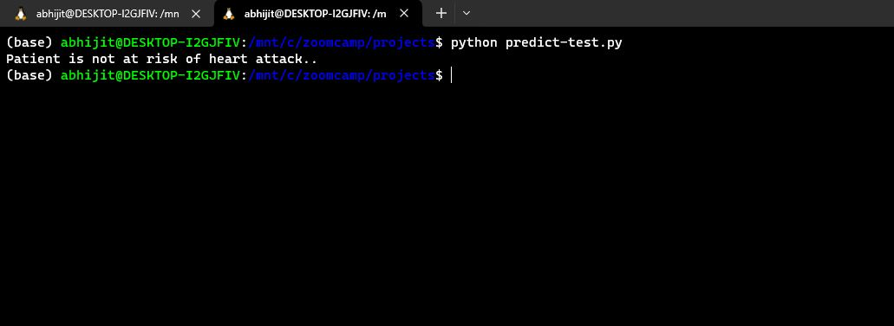

# Heart Attack Risk Prediction

## Problem Description

The outline of the project is to predict whether a patient is prone to risk of a heart attack or not, using different health parameters.

## About the Dataset
 
The Heart Attack Risk Prediction Dataset (synthetic creation generated using ChatGPT to simulate a realistic experience) serves as a valuable resource for delving into the intricate dynamics of heart health and its predictors. Heart attacks, or myocardial infarctions, continue to be a significant global health issue, necessitating a deeper comprehension of their precursors and potential mitigating factors. This dataset encapsulates a diverse range of attributes including age, cholesterol levels, blood pressure, smoking habits, exercise patterns, dietary preferences, and more, aiming to elucidate the complex interplay of these variables in determining the likelihood of a heart attack. By employing predictive analytics and machine learning on this dataset, researchers and healthcare professionals can work towards proactive strategies for heart disease prevention and management. The dataset stands as a testament to collective efforts to enhance our understanding of cardiovascular health and pave the way for a healthier future.

This dataset provides a comprehensive array of features relevant to heart health and lifestyle choices, encompassing patient-specific details such as age, gender, cholesterol levels, blood pressure, heart rate, and indicators like diabetes, family history, smoking habits, obesity, and alcohol consumption. Additionally, lifestyle factors like exercise hours, dietary habits, stress levels, and sedentary hours are included. Medical aspects comprising previous heart problems, medication usage, and triglyceride levels are considered. Socioeconomic aspects such as income and geographical attributes like country, continent, and hemisphere are incorporated. The dataset, consisting of around 7000 records from patients around the globe, culminates in a crucial binary classification feature denoting the presence or absence of a heart attack risk, providing a comprehensive resource for predictive analysis and research in cardiovascular health.

## How to Use 

### Prerequisites

```python
python
git
docker
linux
```

### Cloning the repo

First and foremost, the repo needs to cloned to local for usage. This can be achieved using:

```python
git clone https://github.com/abhijitchak103/heart_attack_risk.git
```

### Acquiring Data

The data used for training the predictive model is stored in `/data/train.csv` in this repo.

### Using Docker Image

```
docker build -t {build-tag} .
```

```
docker run -it --rm -p 8080:8080 {build-tag}
```

`{build-tag}`: Specifies any user-defined tag for docker image. eg. `pred-test`

### Making predictions

By default, the patient parameters are set at:

```
    "gender": "male", 
    "diabetes": "yes", 
    "family_history": "yes", 
    "smoking": "yes", 
    "obesity": "yes", 
    "alcohol_consumption": "yes", 
    "diet": "unhealthy", 
    "previous_heart_problems": "yes", 
    "medication_use": "yes", 
    "country": "united_states", 
    "age": 75, 
    "cholesterol": 360, 
    "heart_rate": 85, 
    "exercise_hours_per_week": 8, 
    "stress_level": 10, 
    "sedentary_hours_per_day": 4.987731820348275, 
    "income": 181290, 
    "bmi": 38, 
    "triglycerides": 369, 
    "physical_activity_days_per_week": 2, 
    "sleep_hours_per_day": 3, 
    "systolic_bp": 200, 
    "diastolic_bp": 130
```
User may change the parameters to test out different scenarios by changing values or parameters in `predict-test.py`

#### Allowed parameters for features (with restrictions):

- gender: male/female
- diabetes - yes/no
- family_history - yes/no
- smoking - yes/no
- obesity - yes/no
- alcohol_consumption - none/light/moderate/heavy
- diet - healthy/average/unhealthy
- previous_heart_problems - yes/no
- medication_use - yes/no
- stress_level - 1-10
- sedentary_hours_per_day - 0-24
- physical_activity_days_per_week - 0-7
- sleep_hours_per_day - 0-24
- country - One of ['Argentina', 'Nigeria', 'Thailand', 'Spain', 'Germany', 'France',
       'South Africa', 'Colombia', 'Italy', 'China', 'Vietnam',
       'United States', 'Japan', 'Canada', 'India', 'United Kingdom',
       'New Zealand', 'Brazil', 'South Korea', 'Australia']

Once, user is happy with patient input, predictions can be made in a new console window inside the project folder.

```python
python predict-test.py
```

## Sample Output

Locally, user shoudl be able to get a similar output to the one shown below upon running all steps successfully.



## Acknowledgement

The project has been possible with the help of a colaborative slack community of DataTalks and specially Alexey.

## Feedback

I am open to feedback from everyone as I am still learning and seeking ways to improve. Please provide a star incase you liked my work.
